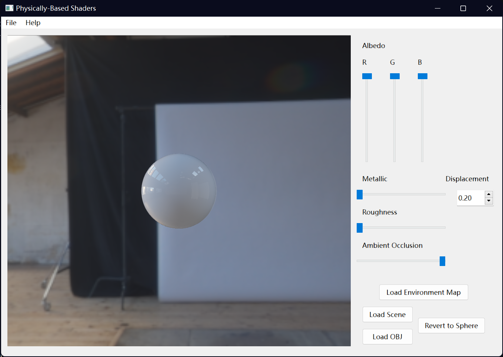
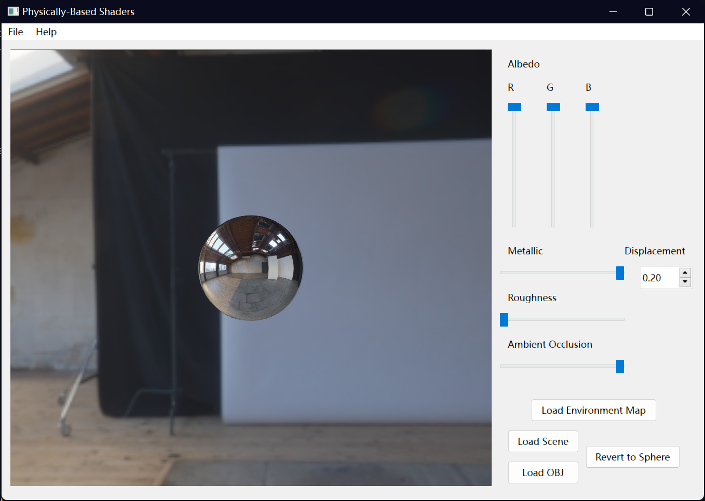
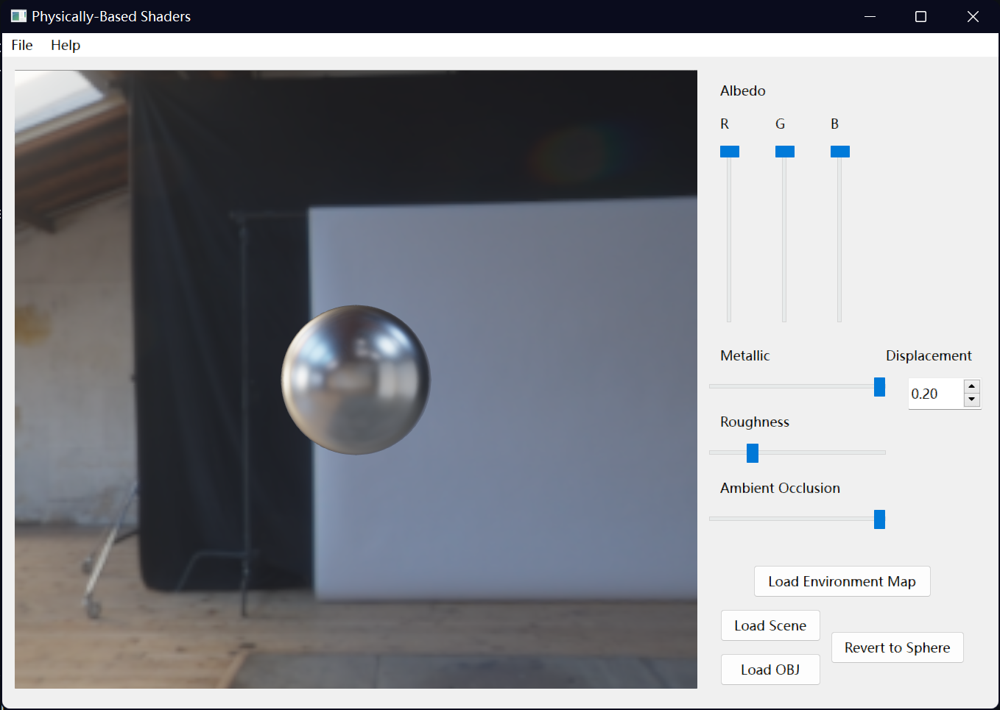
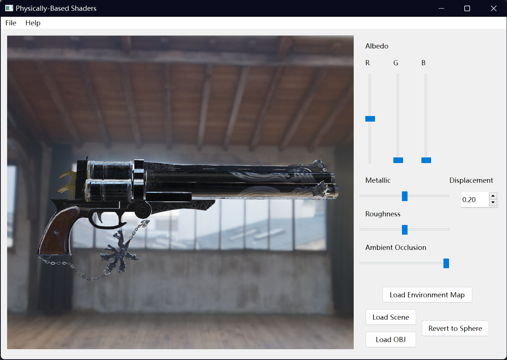

**University of Pennsylvania, Monte Carlo Path Tracer**

* Yilin Li

## Introduction 
This project implements a physically-based shader featuring real-time rendering and customized object model
with metallic and roughness tuning. 

Some scenes are shown below:

## How to Open 
1. Clone the project.
2. Go to folder assignment_package and open `pbrShader` with Qt.
3. Enjoy the path tracer.

## How to Use 
- You can change scenes by click `Load Scenes` and change the environment map by click `Load Environment`.
- You can tune the metallic and roughness with corresponding sliders. 
